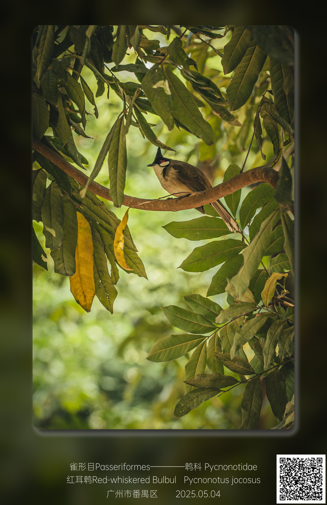

# 📷像收集宝可梦一样标记鸟图

这是一个基于 [Streamlit](https://streamlit.io/) 的 Web 应用，用于对图像进行倒角、美化背景、添加水印文字和二维码等处理，适用于动植物拍摄图片的快速美化与标注。

 <!-- 可换为你自己的截图路径 -->

## ✨ 功能特点

- ✅ 支持上传 JPG/PNG 图片
- 🎨 倒角处理，打造柔和圆角效果
- 🌫 背景放大模糊并调整透明度，突出主体
- 🖍 添加水印文字（分类信息 + 地点 + 拍摄日期）
- 🧱 支持二维码生成（链接跳转，源自物种列表 JSON）
- 🌗 支持阴影设置、文字样式自定义
- 🐍 使用 Python + Streamlit 开发，界面简洁易用

---

## 🧩 安装指南

确保你已安装 Python 3.8 以上：

```bash
git clone https://github.com/your-username/image-watermark-generator.git
cd image-watermark-generator
pip install -r requirements.txt
